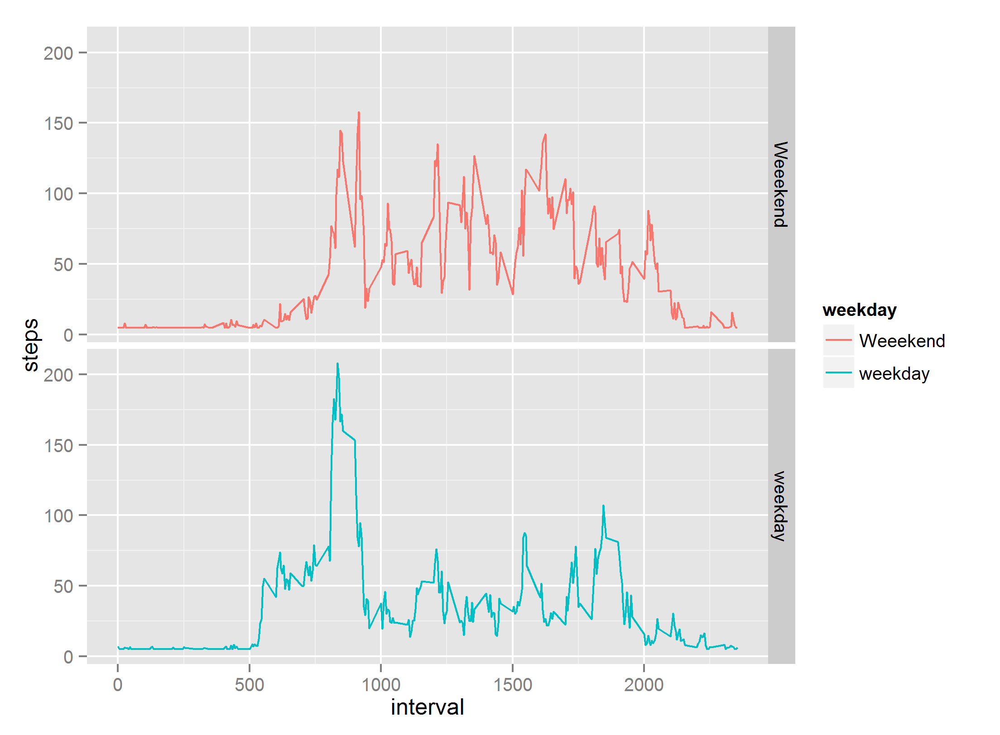

# Reproducible Reserach Peer Assignment 1  

## Load the Data

```r
data <- read.csv("activity.csv", colClasses = c("numeric", "factor", "numeric"))
```
## Draw the histogram for number of steps taken per day  
-  Aggregate the data for each day and then plot histogram


```r
#aggregate the data for each day
activityPerDay <- aggregate(data$steps, by=list(data$date), FUN= sum)
names(activityPerDay) <- c("date", "steps")
hist(activityPerDay$steps, col="red", xlab="steps/day", breaks=nrow(activityPerDay), main="Steps taken per day" )
```

 
- Display the mean and median of 


```r
mean(activityPerDay$steps, na.rm=TRUE)
```

```
## [1] 10766
```

```r
median(activityPerDay$steps, na.rm=TRUE)
```

```
## [1] 10765
```

## Average daily activity pattern

- Average the data across all days for each 5 min interval


```r
#make interval as factor and aggregate across all days for each interval
data$interval <- as.factor(data$interval)
actperint <- aggregate(data$steps, by=list(data$interval), FUN=mean, na.rm=TRUE)
names(actperint) <- c("interval", "meanactivity")
plot(actperint, type="l", col="blue", xlab="interval", ylab="activity" )
```

 

- The 5 min interval which has the max value


```r
actperint[which(actperint$meanactivity >= max(actperint$meanactivity)),]
```

```
##     interval meanactivity
## 104      835        206.2
```

## Missing Values

- Rows with NA


```r
nrow(data[!complete.cases(data),])
```

```
## [1] 2304
```

- Fill the missing values


```r
cleanData <- transform(data, steps = ifelse (is.na(steps), mean(steps, na.rm=TRUE), steps))
activityPerDay <- aggregate(cleanData$steps, by=list(cleanData$date), FUN= sum)
names(activityPerDay) <- c("date", "steps")
hist(activityPerDay$steps, col="red", xlab="steps/day", breaks=nrow(activityPerDay), main="Steps taken per day" )
```

 
- Display the mean and median of imputed data


```r
mean(activityPerDay$steps)
```

```
## [1] 10766
```

```r
median(activityPerDay$steps)
```

```
## [1] 10766
```

### mean and median is pretty much the same after filling the missing values

```r
cleanData$weekday <- weekdays(as.Date(cleanData$date))
cleanData <- transform(cleanData, weekday = ifelse((weekday == "Saturday" |  weekday == "Sunday"), "Weeekend", "weekday"))
names(cleanData)
```

```
## [1] "steps"    "date"     "interval" "weekday"
```

- plot data weekend vs weekdays for activity averaged across weekdays or weekend

### Activity pattern weekdays vs weekends


```r
cleanData <- aggregate(cleanData$steps, by=list(cleanData$interval,cleanData$weekday ), FUN= mean)
names(cleanData) <- c("interval", "weekday", "steps")
library(ggplot2)

sp2 <- ggplot(data=cleanData , aes(x=interval, y=steps)) + geom_point(shape=1)
sp2 + facet_grid( weekday~.)
```

 
- The time of the day for peak activities varies between weekday and weekends.
